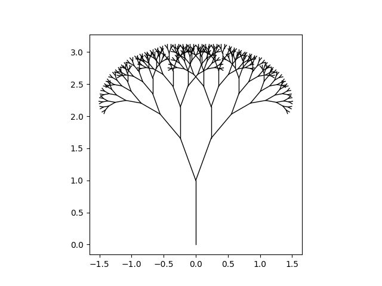

# A fractal canopy

This is a [fractal canopy](https://en.wikipedia.org/wiki/Fractal_canopy).
The pattern is generated as a tree, in which each branch splits into two at a fixed angle.
The ratio of the length of the new branch and the old one is also fixed.
