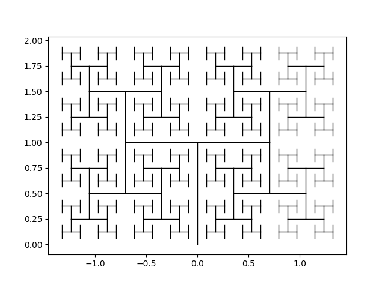

# A fractal canopy

This is a [fractal canopy](https://en.wikipedia.org/wiki/Fractal_canopy).
The pattern is generated as a tree, in which each branch splits into two at a fixed angle.
The ratio of the length of the new branch and the old one is also fixed.

By tweaking the branching angle, we can generate patterns such as the [H-tree](https://en.wikipedia.org/wiki/H_tree).
Here, the new and old branches are perpendicular, and are scaled down by a factor of 1/√2.

Many structures in nature resemble fractal canopies, such as systems of blood vessels or bronchioles in a lung.
[Lichtenberg figures](https://en.wikipedia.org/wiki/Lichtenberg_figure) are a closely related class of fractals which are observed during electrical breakdown, for instance lightning.
Another related class are [Brownian trees](https://en.wikipedia.org/wiki/Brownian_tree), which are seen during certain types of random walks where particles are allowed to aggregate together.
